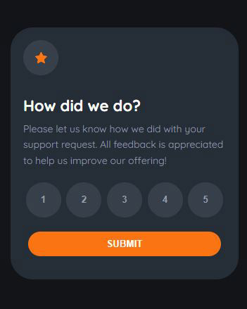
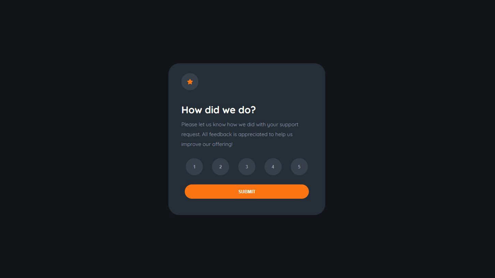

# Frontend Mentor - Order summary card solution

This is a solution to the [Order summary card challenge on Frontend Mentor](https://www.frontendmentor.io/challenges/interactive-rating-component-koxpeBUmI).

## Table of contents

- [Overview](#overview)
  - [The challenge](#the-challenge)
  - [Screenshot](#screenshot)
  - [Links](#links)
- [Process](#process)
  - [Built with](#built-with)
- [Author](#author)

## Overview

### The challenge

The challenge is to build out the order summary card component and get it looking as close to the design as possible.
Your users should be able to:

- View the optimal layout for the app depending on their device's screen size
- See hover states for all interactive elements on the page
- Select and submit a number rating
- See the "Thank you" card state after submitting a rating

### Screenshot

The designs created to the following widths:

- Mobile: 375px

- Desktop: 1440px

### Links

- [Live Site URL](https://frontend-challanges.herokuapp.com/intective-rating)

## Process

### Built with

- [React](https://reactjs.org/)
- [SCSS](https://sass-lang.com/)
  - Flexbox
  - Grid
  - Varibals

## Author

- Website - [Katya Rukosuev](https://www.katya-ru-fullstack.com//)
- Frontend Mentor - [@RuKatya](https://www.frontendmentor.io/profile/RuKatya)
- Linkedin - [Katya Rukosuev](https://www.linkedin.com/in/katya-rukosuev/)
